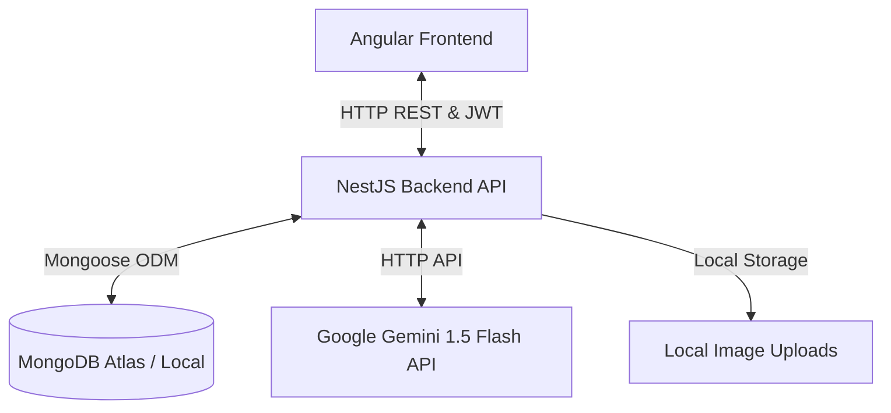

# AirbEMI Application Technical Report

Welcome to the full technical documentation and report for the **AirbEMI** application. This report outlines the overall system architecture, database design, NoSQL database features, communication flows, and core application functionality.

---

## 1. Executive Summary & Architecture Overview

**AirbEMI** is a modern, high-performance web clone of Airbnb tailored specifically for rental listings in Morocco (e.g., Marrakech, Agadir, Casablanca, Chefchaouen). The system is built using a decoupled **Frontend-Backend-Database** architecture.



### Technical Stack Components
*   **Frontend**: Angular (v17/18, TypeScript, TailwindCSS, Standalone Components, Reactive State with Angular Signals).
*   **Backend**: NestJS (TypeScript, Node.js, Controller-Service-Module modular architecture).
*   **Database**: MongoDB Atlas (NoSQL Document Store) accessed via **Mongoose** (Object Document Mapper).
*   **AI Engine**: Google Generative AI (Gemini 1.5 Flash) for intent detection and conversational search.
*   **Authentication**: Passport.js with JWT Strategy, Local strategy (Bcrypt hashing), and Google OAuth2 integration.

---

## 2. Database Schema & Collections Design

The application utilizes MongoDB to store unstructured and semi-structured documents across five core collections.

### 2.1. `users` Collection
Stores details for regular travelers and property hosts.
*   **Key Fields**:
    *   `firstName` / `lastName`: (String, Required)
    *   `email`: (String, Unique, Required)
    *   `passwordHash`: (String, Optional – omitted for Google OAuth logins)
    *   `role`: (String, Enum: `'user'`, `'admin'`, Default: `'user'`)
    *   `isHost`: (Boolean, Default: `false`)
    *   `googleId`: (String, Optional – present for users registered via Google)
    *   `timestamps`: Automatically tracked by Mongoose (`createdAt`, `updatedAt`).

### 2.2. `properties` Collection
Stores rental listing details, including geospatial coordinates and amenities.
*   **Key Fields**:
    *   `hostId`: (ObjectId, Ref: `'User'`)
    *   `title` / `description`: (String, Required)
    *   `pricePerNight`: (Number, Min: `0`, Required)
    *   `maxGuests`: (Number, Min: `1`, Required)
    *   `location`: (GeoJSON Point: `{ type: 'Point', coordinates: [longitude, latitude] }`)
    *   `address`: (Nested Object: `{ city: String, country: String }`)
    *   `images`: (Array of Strings)
    *   `amenities`: (Array of Strings)
    *   `isActive`: (Boolean, Default: `true`)
*   **Indices**:
    *   `location: '2dsphere'` (Geospatial Index for distance-based queries).
    *   `{ title: 'text', description: 'text' }` (Full-Text Search Index).

### 2.3. `reservations` Collection
Tracks bookings made by guests for property listings.
*   **Key Fields**:
    *   `propertyId`: (ObjectId, Ref: `'Property'`, Required)
    *   `guestId`: (ObjectId, Ref: `'User'`, Required)
    *   `checkInDate` / `checkOutDate`: (Date, Required)
    *   `totalPrice`: (Number, Required)
    *   `status`: (String, Enum: `'pending'`, `'confirmed'`, Default: `'pending'`)

### 2.4. `reviews` Collection
Stores guest feedback and star ratings.
*   **Key Fields**:
    *   `propertyId`: (ObjectId, Ref: `'Property'`, Required)
    *   `reviewerId`: (ObjectId, Ref: `'User'`, Required)
    *   `reservationId`: (ObjectId, Ref: `'Reservation'`, Required)
    *   `rating`: (Number, Min: `1`, Max: `5`, Required)
    *   `comment`: (String, Required)

### 2.5. `faqs` Collection
Used by the AI Chatbot to instantly fetch pre-answered questions.
*   **Key Fields**:
    *   `question`: (String, Required)
    *   `answer`: (String, Required)
    *   `keywords`: (Array of Strings)
*   **Indices**:
    *   `{ question: 'text', keywords: 'text' }` (Full-Text Search Index).

---

## 3. Core Database Functionalities & Implementation

Mongoose and MongoDB are heavily utilized for operations requiring performance, geospatial searching, and real-time processing.

### 3.1. Full-Text Search
For search bars and chatbot queries, MongoDB full-text indexes match terms and sort results by relevance:
```typescript
const faqResult = await this.faqModel.find(
  { $text: { $search: userMessage } },
  { score: { $meta: 'textScore' } }
).sort({ score: { $meta: 'textScore' } }).limit(1).exec();
```

### 3.2. Geospatial Queries
Finding properties within proximity of map coordinates uses MongoDB's `$near` operator:
```typescript
if (query.lng && query.lat && query.maxDistance) {
  filter.location = {
    $near: {
      $geometry: {
        type: 'Point',
        coordinates: [parseFloat(query.lng), parseFloat(query.lat)],
      },
      $maxDistance: parseInt(query.maxDistance, 10), // in meters
    },
  };
}
```

### 3.3. Advanced Aggregation Pipeline (Host Dashboard Stats)
The system calculates complex dashboard metrics by executing a multi-stage aggregation pipeline:
1.  **`$match`**: Filters listings to include only those owned by the specific host.
2.  **`$lookup`**: Performs a left outer join to pull all matching documents from the `reviews` collection where `propertyId` equals the listing's ID.
3.  **`$project`**: Computes the size of the reviews array (`reviewsCount`) and calculates the mathematical average of ratings.
4.  **`$group`**: Groups results to compute total properties, average listing price, sum of all reviews, global rating average, and compile an array of individual property stats using `$push`.

```typescript
this.propertyModel.aggregate([
  { $match: { hostId: new mongoose.Types.ObjectId(hostId) } },
  { $lookup: { from: 'reviews', localField: '_id', foreignField: 'propertyId', as: 'reviews' } },
  { $project: { title: 1, pricePerNight: 1, reviewsCount: { $size: '$reviews' }, averageRating: { $avg: '$reviews.rating' } } },
  { $group: {
      _id: null,
      totalProperties: { $sum: 1 },
      averagePricePerNight: { $avg: '$pricePerNight' },
      totalReviews: { $sum: '$reviewsCount' },
      globalAverageRating: { $avg: '$averageRating' },
      propertiesStats: { $push: { title: '$title', rating: '$averageRating', reviews: '$reviewsCount' } }
  } }
]);
```

### 3.4. Change Streams (Real-Time Database Triggers)
The NestJS application listens directly to write events in MongoDB in real time using Change Streams:
```typescript
const changeStream = this.reservationModel.watch();
changeStream.on('change', (change) => {
  if (change.operationType === 'insert') {
    const doc = change.fullDocument;
    console.log(`[MONGODB CHANGE STREAM] 🛎️ New reservation confirmed!`);
  }
});
```

### 3.5. Overlapping Booking Prevention
To ensure a property is never double-booked, the backend validates dates using MongoDB range comparisons before saving:
```typescript
const overlappingReservation = await this.reservationModel.findOne({
  propertyId: propertyObjectId,
  status: { $in: ['confirmed', 'pending'] },
  checkInDate: { $lt: checkOut },
  checkOutDate: { $gt: checkIn },
}).exec();
```

---

## 4. Communication & Flow Architecture

### 4.1. Client-Server Communication
*   **REST API**: Angular elements call NestJS backend routers using standard HTTP protocols (`GET`, `POST`, `DELETE`).
*   **Security Interceptor**: The Angular `jwtInterceptor` inspects browser Storage, fetches the authentication token, and appends it to all outbound HTTP requests inside the `Authorization: Bearer <token>` header.
*   **CORS Configuration**: Handles communication between `http://localhost:4200` (Frontend) and `http://localhost:3000` (Backend).

### 4.2. Chatbot Logic & Intelligent Fallbacks
When a user interacts with the floating chat widget on the bottom right, it triggers the chatbot flow:

```mermaid
sequenceDiagram
    participant User as Angular Chat UI
    participant BE as NestJS Chatbot Service
    participant FAQ as MongoDB FAQ Coll
    participant Gemini as Gemini 1.5 Flash API
    
    User->>BE: POST /chatbot/ask (Question)
    BE->>FAQ: Full-Text Search ($text)
    alt Match found in FAQ
        FAQ-->>BE: Answer
        BE-->>User: Return text answer
    else No FAQ Match
        BE->>Gemini: Request Intent Detection & Answer
        alt AI Success
            Gemini-->>BE: Returns JSON Search parameters or general response
            BE-->>User: Return response (or property recommendation card)
        type Offline Fallback
            BE->>BE: Run local Regex NLP (Extract City/Amenities)
            BE-->>User: Return matched properties or offline warning
        end
    end
```

---

## 5. Additional System Features

*   **Google OAuth2 Integration**: Allows user authentication via Google Accounts using `PassportStrategy` (`google-oauth20`). The profile information returns `googleId`, creating a user instance in MongoDB without requiring a local password.
*   **Local Image Uploads**: Hosts property pictures using `Multer` disk storage. Files are validated to confirm they are valid image mime-types (JPEG, PNG, WebP) and are stored in `/uploads` on the server under unique filenames. Max size limits are enforced at 10MB.
